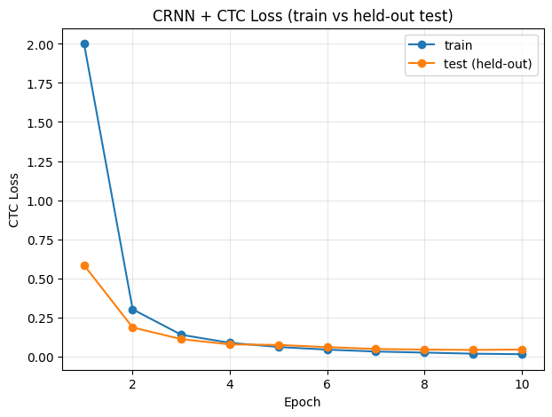
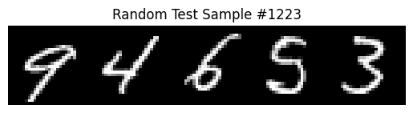

# Text Recognition dengan CRNN + CTC Loss

Implementasi PyTorch dari CRNN (Convolutional Recurrent Neural Network) yang dilatih dengan CTC (Connectionist Temporal Classification) loss untuk pengenalan teks berurutan, didemonstrasikan pada dataset sintetis urutan digit MNIST.

## Gambaran Umum

Text recognition (OCR) perlu membaca *urutan* karakter dari sebuah gambar, bukan sekadar mengklasifikasikan satu karakter saja. Repo ini menunjukkan arsitektur klasik untuk tugas tersebut:

- **CNN** — mengekstrak fitur visual (garis, goresan, bentuk) dari gambar input
- **Bidirectional LSTM** — membaca urutan fitur hasil CNN dari kiri-ke-kanan dan kanan-ke-kiri untuk memodelkan urutan dan konteks karakter
- **CTC Loss** — menyelaraskan urutan prediksi dengan label target tanpa perlu segmentasi karakter secara eksplisit, dan menggabungkan prediksi yang berulang/blank menjadi string akhir

## Dataset

Karena tidak memakai dataset "urutan multi-digit" yang siap pakai, dataset sintetis dibuat langsung dari MNIST: 5 gambar digit MNIST acak digabung secara horizontal menjadi satu gambar `[1, 28, 140]` per sampel, dengan urutan digitnya sebagai label (mis. gambar → label `"31841"`).

## Arsitektur

```
Input [B, 1, 28, 140]
  → Conv2d(1, 64) + ReLU + MaxPool
  → Conv2d(64, 128) + ReLU + MaxPool
  → reshape ke urutan [B, W, C*H]
  → BiLSTM(hidden=128, bidirectional=True)
  → Linear(256, 11)   # 10 digit + 1 CTC blank
  → log_softmax
```

Dilatih dengan `nn.CTCLoss(blank=10)` dan optimizer Adam (lr=1e-3) selama 10 epoch di Google Colab (GPU). Bobot hasil training disimpan ke Google Drive (di-mount saat runtime) supaya nggak hilang kalau runtime Colab reset.

## Hasil (terverifikasi — hasil run Colab asli)

Held-out test set: 2.000 sequence yang dibuat dari test split MNIST sendiri — gambar yang belum pernah dilihat model saat training.

| Epoch | Train Loss | Test Loss (held-out) |
|-------|-----------|------------------------|
| 1     | 2.0011    | 0.5838                  |
| 2     | 0.3011    | 0.1850                  |
| 3     | 0.1380    | 0.1102                  |
| 4     | 0.0867    | 0.0765                  |
| 5     | 0.0599    | 0.0732                  |
| 6     | 0.0431    | 0.0590                  |
| 7     | 0.0308    | 0.0472                  |
| 8     | 0.0242    | 0.0432                  |
| 9     | 0.0171    | 0.0409                  |
| 10    | 0.0138    | 0.0437                  |



**Evaluasi kuantitatif**, dihitung di seluruh 2.000 sequence held-out test:

| Metrik | Nilai |
|---|---|
| Sequence accuracy (exact match) | 93.45% |
| Character Error Rate (CER) | 1.37% |

**Cek kualitatif** — satu sampel acak dari held-out test set, hasil greedy-decode:

```
Target   : 94653
Prediksi : 94653
```



> **Catatan cakupan:** test loss sedikit naik dari epoch 9 (0.0409) ke epoch 10 (0.0437) sementara train loss terus turun — tanda awal overfitting ringan. Angka akurasi/CER di atas tetap dihitung dari bobot epoch 10 (yang terakhir); run yang lebih pendek atau early stopping mungkin dapat checkpoint yang sedikit lebih baik, tapi itu belum dieksplorasi lebih jauh di sini.

## Catatan setup

- **Penyimpanan model:** notebook ini mount Google Drive dan menyimpan/memuat model hasil training (`crnn_mnist.pt`) di `/content/drive/MyDrive/text-recognition-crnn-ctc/`, jadi tetap ada meski runtime Colab reset.

## Cara menjalankan

1. Buka `notebooks/text_recognition_crnn_ctc.ipynb` di Google Colab
2. Set runtime ke GPU
3. Jalankan semua cell — MNIST otomatis terunduh saat run pertama, dan kamu akan diminta akses Drive saat model disimpan

## Struktur repo

```
.
├── notebooks/
│   └── text_recognition_crnn_ctc.ipynb
├── images/
│   ├── training_loss.png
│   └── sample_prediction.png
├── LICENSE
└── README.md
```

## Lisensi

MIT — lihat [LICENSE](LICENSE).
